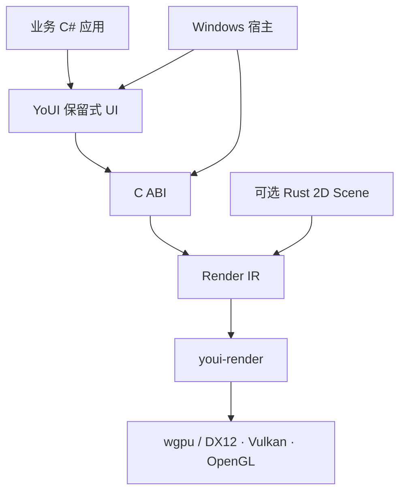

# 架构与约定

## 依赖方向

`youi-render` 不认识控件、节点或布局。`youi-scene` 只依赖 renderer 的图元接口。Win32 消息循环位于独立 C# 项目，渲染器支持无窗口纹理输出。当前 C# 保留树与可选 Rust 场景树分别拥有身份；尚未提供跨两棵树共享节点的映射。

## 帧与资源边界

- ABI 版本 `0x00010000`；80 字节命令、48 字节统计结构，Rust/C#/C++ 的结构布局有检查。
- 一次同步渲染提交包含连续命令数组及 UTF-8 字节区。输入内存只在调用期间借用；返回后 C# 可重用缓冲。
- 渲染器句柄来自注册表，图像句柄使用进程内单调 ID，释放后失效。原生场景使用 index + generation，防止槽位复用产生旧节点别名。
- C ABI 检查句柄、空指针、范围、有限浮点值、UTF-8 和作用域平衡；调用方仍须保证非空指针实际有效，这是 C ABI 的前置条件。
- 错误通过返回码和线程局部错误文本传递。Rust panic 不跨越 ABI。发生原生 panic 后不承诺恢复，调用方应结束受影响实例/进程；完整设备重建尚未实现。
- Managed renderer 约束在创建线程调用；全局原生注册表当前将渲染器调用串行化，多窗口并行渲染不是此版优化目标。

## Render IR 与绘制

| kind | 操作 | 参数 |
|---|---|---|
| 0 | 圆角矩形、纵向渐变 | rect、color/color2、radius |
| 1 | 文字 | UTF-8 offset/length、font_size、flags bit 0 为粗体 |
| 2 / 3 | 压入 / 弹出矩形裁剪 | rect，嵌套求交 |
| 4 / 5 | 开始 / 结束隔离合成层 | color.a 为整体透明度 |
| 6 | 任意三角形 | rect.xy=p0、rect.wh=p1、reserved=p2 |
| 7 | 图像 | flags=图像 ID、rect、color 为 tint |

四边形使用实例缓冲，顶点在 GPU 生成。三角形同样进入有序实例流，后三个顶点退化，不重复混合。相邻且使用相同纹理源的项合并绘制；不按纹理全局排序。每实例携带裁剪矩形，在片元阶段裁剪；当前不是硬件 scissor 优化，也不支持旋转形状遮罩。

隔离层生成依赖树：子层先执行，父层在原绘制位置采样其纹理。这支持嵌套 group opacity，尚不等同于通用 Render Graph；背景模糊、自定义资源读写 pass、混合插件不能用此 API 假装支持。

离屏纹理复用；目前按整个视口分配而非局部 bounds。每帧最多 16 层，层深度最多 8，累计离屏像素预算 64 Mi pixels。resize 会清空纹理池。Canvas 本身不产生离屏层；只有明确 BeginLayer / CompositedOpacity 才产生。

## 颜色与坐标

输入颜色与上传图像为 **straight alpha、sRGB**。着色器在混合前转换为线性色彩并预乘 alpha；图集和输出使用 sRGB 纹理格式；层纹理保留已预乘的内容，合成时只乘整体透明度。

本实现统一采用左上原点、X 向右、Y 向下；这是相对于分享设计“Y 向上”的明确差异。这样 C# 桌面布局、文字和指针坐标无需各自反转。`RectTransform.Resolve` 保留分享中的锚点/轴心/sizeDelta 公式，最终矩形是唯一布局结果。

C# 布局单位是 DIP。Windows 宿主将整帧绘制命令转换为物理像素；文字测量使用相同 DPI 比例、相同 COSMIC 排版再换回 DIP。独立原生接口接收物理像素。

## 文字与图集

COSMIC Text 提供字体选择、Unicode 塑形、双向文字和换行；Swash 光栅化。系统字体加载一次。排版按 text/size/width/bold 缓存，测量与绘制使用同一缓存结果。512 条排版缓存满后整体清空，暂不是 LRU。

2048×2048 RGBA8 图集由文字和图像共用，16 MiB。字形按 CacheKey 去重，图像释放后可复用同尺寸槽位。图集满时明确返回错误，当前没有多页图集或字形驱逐。上传入口接收 RGBA 数据，不含磁盘解码、网络加载、热重载或纹理压缩。

## 保留 UI 与输入

属性变更区分 Layout / Paint / Semantics。颜色、视觉偏移与透明度不触发布局；文字及尺寸变化触发布局。无变化的文档返回缓存命令。当前布局失效传播至根后重排整棵可见树，尚无子树布局缓存；虚拟列表限制了实际树大小。

自由布局与 StackPanel 可共存于不同节点。一个子节点不能同时由 StackPanel 和独立 RectTransform 控制，冲突立即报错。StackPanel 先测量需求，分配宽度后重新测量文字并排列高度；尚未实现通用四阶段依赖图、最小尺寸收缩或 CSS Flexbox。

命中测试逆绘制顺序，遵守祖先裁剪和视觉偏移。事件按 capture → target → bubble 分发，路径提前冻结，允许处理器安全移除或重挂节点。按钮支持捕获、松开激活和取消；Modal 限制命中与焦点循环，关闭后恢复焦点。

VirtualList 是定高实现，仅实例化视口所需行与 overscan，滚动时重新绑定数据索引。列表自身持有键盘焦点，复用行不会转移逻辑焦点。异步数据、动态行高及稳定业务 ID 映射尚未实现。

Windows 宿主桥接 WM_CHAR、IME preedit/result、组合窗口位置与 DPI。TextBox 按 Unicode grapheme 删除与移动光标，支持 Shift 选择、Ctrl+A/C/X/V、Ctrl+Z/Y 及最多 100 步撤销。剪贴板通过独立平台服务接入；真实窗口粘贴和撤销已验证。鼠标定位/拖选、密码输入和完整多行编辑尚未实现。IME 当前主要完成消息逻辑，不声称实测全部中文/日文输入法。

Semantics 可导出控件名称/角色/值/矩形，但还没有 UI Automation / AccessKit 平台适配。它是独立数据输出，不能视为屏幕阅读器已可用。
